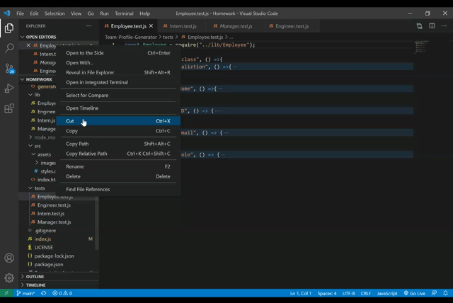

# Team Profile Generator
## Description

The team profile generator is an application that supports Managers to create a fast webpage that displays their team's basic informaiton. 

This application is a Command Line Application (CLI) that relies on simple list of prompt questions and upon filling out the responses to these questions an HTML page is automatically generated with a clean and easy to use user interface. The following image depicts the final HTML page displayed.

## Table of Contents

[Description](#description)

[Technologies](#Technologies)

[Installation](#Installation)

[Usage](#usage)

[How-it-Works](#How-it-Works)

[License](#License)

[Badges](#Badges)

[Contributing](#contributing)

[Tests](#tests)

[Questions](#questions)

## Technologies

1. HTML
2. CSS
3. Bootstrap
4. JavaScript
5. Node.js
6. Inquirer
7. Jest

## Installation

To install the application, follow the following steps:
1. Clone the repo on your local machine
2. Install the [inquirer package](https://www.npmjs.com/package/inquirer) to prompt the list of questions through `npm install inquirer` command
3. Install [jest package](https://www.npmjs.com/package/jest) for testing through `npm install jest` command

## Usage

The application is an automated easy way to build a simple webpage that creates a team roster in a matter of minutes and displays it as an easy to use HTML page with dynamic links to the users e-mails and GitHub profiles.

## How it works

Upon opening Visual Studio Code (VSC), right click on the `<index.js>` file and open it in the Integrated Terminal in VSC, the applicaiton is invoked through typing the command `Node index.js` in the Integrated Terminal

Within the Integrated Terminal a list of questions prompted through the usage of the inquirer package will appeare one by one, as illustrated in the below demo.

View the invoke and answering the prompted questions Demo [Video](https://drive.google.com/file/d/1FZdjRyglaBqqKaL2hdQFKWqIEMQoYDCr/view)

### Questions Prompts

The prompted questions aim at building a simple team structure that inherits from the higher level class Employee that provides informaiton about the name, id and e-mail parameters which later extends to create a Manager with an office number, an Engineer with a Github profile link or an Intern with the name of the school they belong to. 
* The GitHub profile link generated will redirect the user to the GitHub profile page (provided through prompts)
* The emial link will redirect the user to the their default email program and populates the TO field of the email with the address 

Upon answering all the questions an HTML `<genetatedindex.html>` will be automatically generated, as illustrated in the below demo.

View the [Video](https://drive.google.com/file/d/1tDyKklkteBCH80E-3qU6Nj2TzF0YdVxU/view) demo of the `<genetatedindex.html>` and the the final HTML page result on the browser

## License

## Badges

## Contributing 

To contribute to this project, please make sure you follow the guidelines in [The Contributor Covenant](https://www.contributor-covenant.org/) as general guidelines.
Kindly maintain the highest ethics and respect. For further questions or requests kindly contact me through my [Email](mailto:noha_ashraf85@hotmail.com) or [GitHub](https://github.com/NohaAshraf85)

## Tests 

The application has been tested using the [jest package](https://www.npmjs.com/package/jest), note:(requires installation through `npm install jest` command).

The unit test is conducted on the 4 classes that form the solution:

Test File | Class.js
------------ | -------------
Employee.test.js | Employee.js
Engineer.test.js | Engineer.js
Intern.test.js| Intern.js
Manager.test.js | Manager.js

View the video demo of [Unit-Testing](https://drive.google.com/file/d/1yGDZHY-fSQ54Jte3vhhA2khq0PRMWK2Z/view)

## Questions

For any questions, please contact me through [GitHub](https://github.com/NohaAshraf85) 
or [Email](mailto:noha_ashraf85@hotmail.com)

